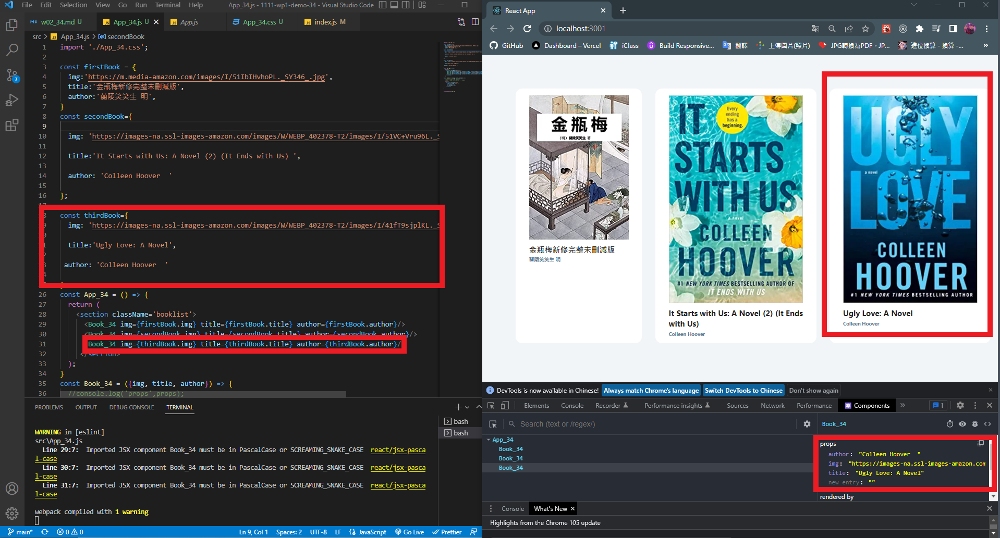

### w02-P1:Add w01 files

### W02-p2: Add two more books based on your ID's last digit

### W02-P3: Add two more books (total = 5 books), marked 4th or 5th book based on your ID's last digit

### W02-p4: Make components -- Booklist_05.js, Book_05.js, data.js, App_05.js

### W02-p5: copy W02 files to demo/w02_booklist

### W02-p6: ALL logs

