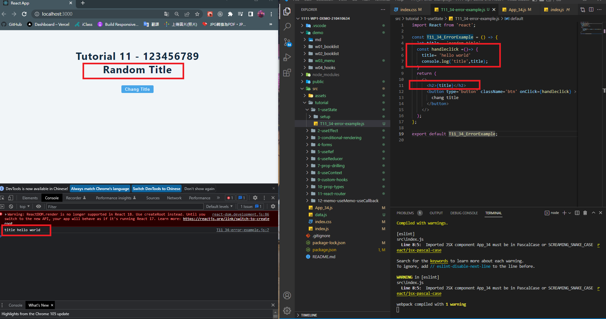
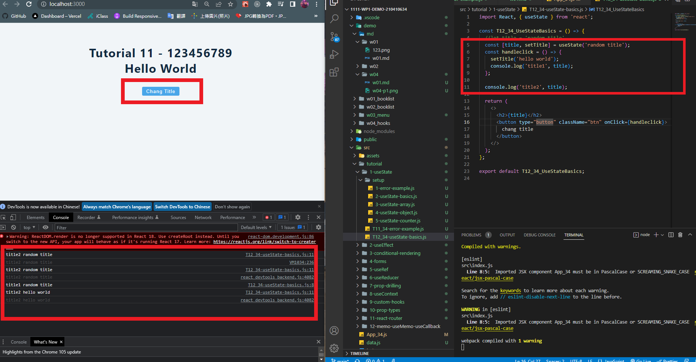
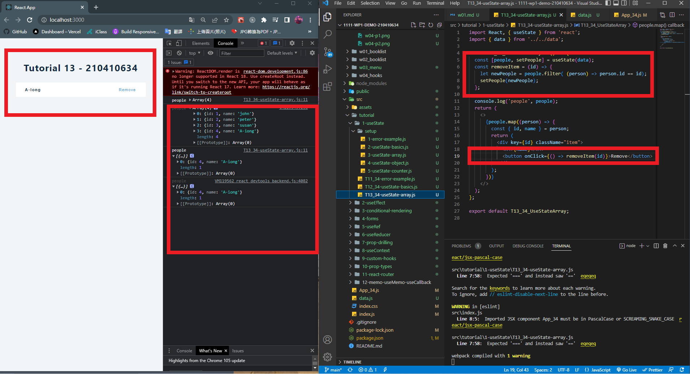
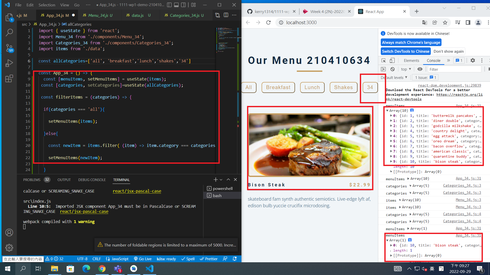

[git hub](https://github.com/A-iong/1111-wp1-demo-210410634.git)

### w04-p1: hooks tutorial T11_34



### W04-P2: Hooks Tutorial T12_34, fix problem in T11_34



### W04-P3: Hooks Tutorial T13_34, useState using array of objects with remove item capability



### W04-logs: show all four logs done today


```
User@E213-55 MINGW64 ~/Desktop/2N/1111-wp1-demo-210410634 (main)
$ git push -f origin main
remote: Repository not found.
fatal: repository 'https://github.com/A-iong/1111-wp1-demo-210410634.git/' not found
```