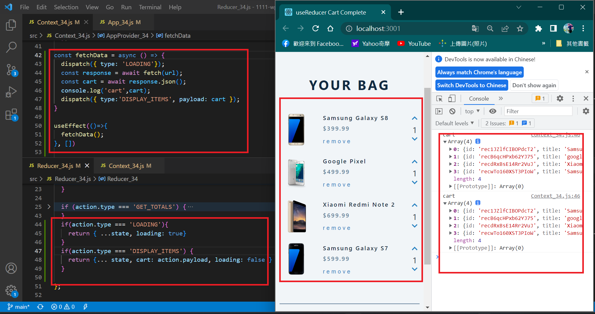
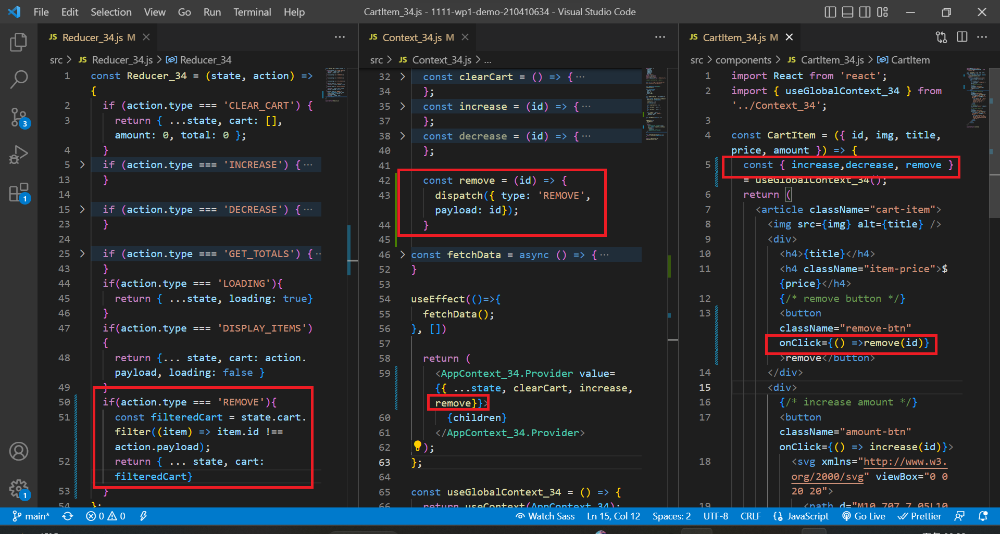
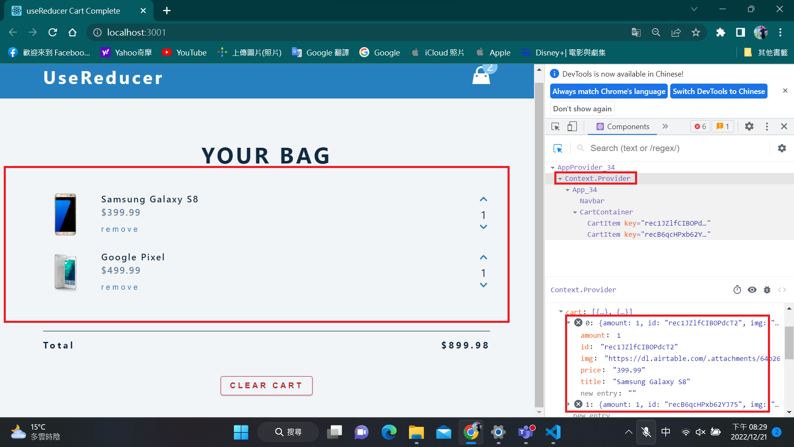
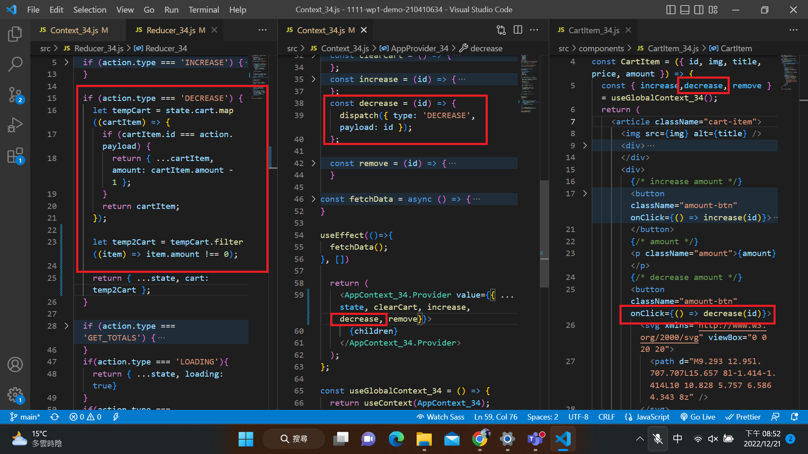
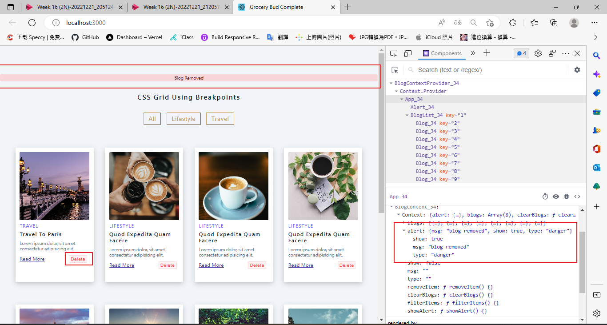
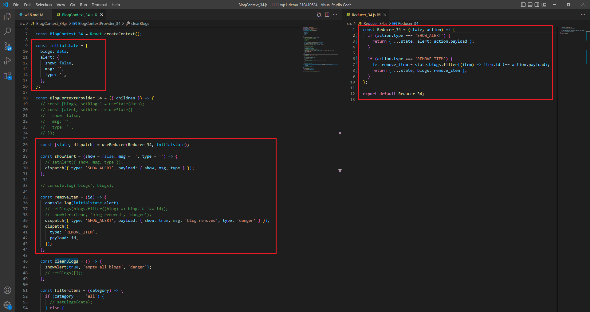

### W16-P1: fetch cart data from url (API)

### W16-P2: remove cart item

### W16-P3: decrease amount of a cart item

### W16-P4: modify w14_quiz1_context_2 to use useReducer, and can remove a blog
 

 

### W16-LOG
