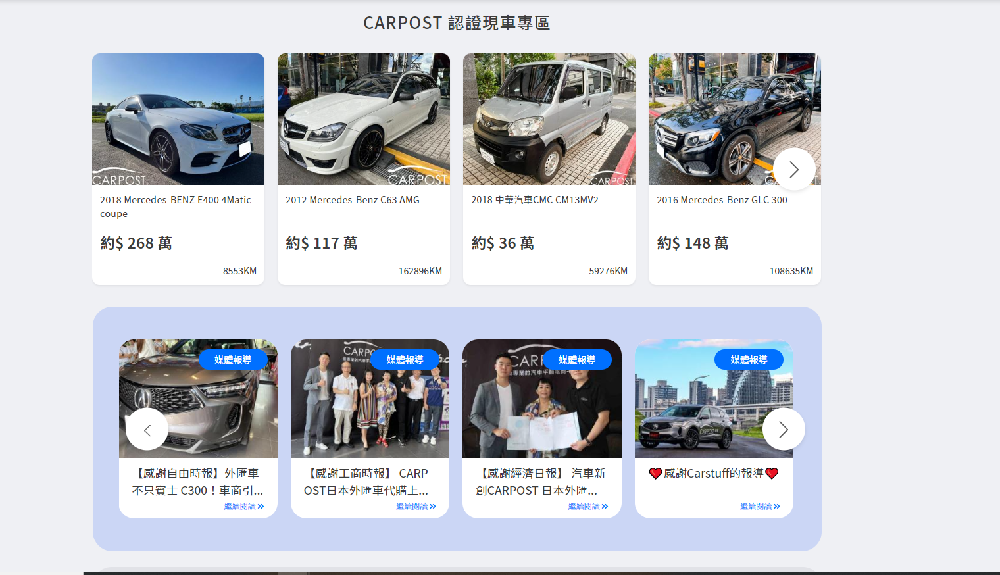
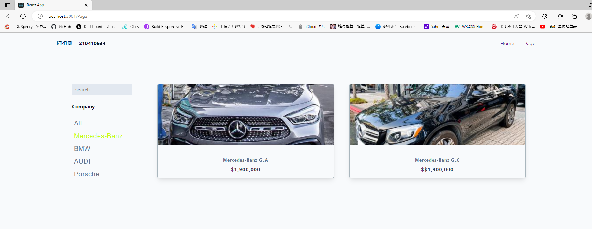
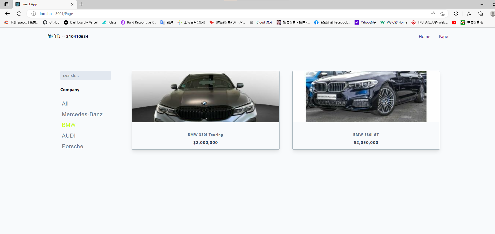
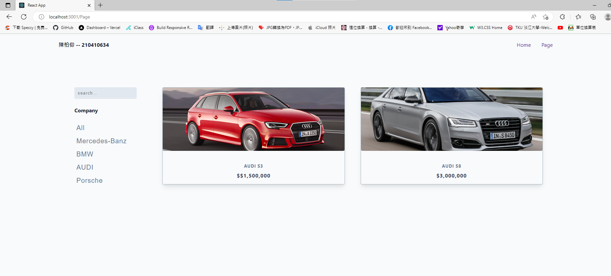
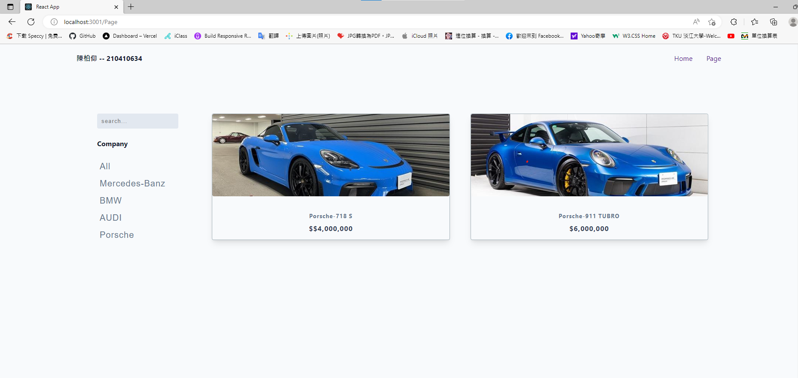
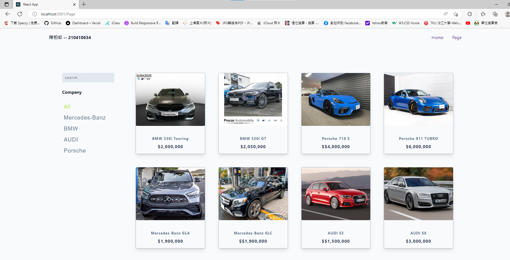

### 210410634 陳柏仰 補救教學

### 第一部分

#### 1.1 提供 theme 來源 URL 及圖片:

Theme 來源網址: [CARPOST](https://www.carpost.tw/)
Theme 截圖: 

#### 1.2 theme 介紹:

本 Theme 可以拆分成以下部分

1. 側面 Menu，共可分成 5 個種類
   

```html
<div className="filter-left">
  <div className="left-content">
    <form className="input-form">
      <input type="text" className="search-input" placeholder="search..." />
    </form>
    <h4>Company</h4>
    <article className="companies">
      <button className="company-btn">All</button>
      <button className="company-btn">Mercedes-Banz</button>
      <button className="company-btn">BMW</button>
      <button className="company-btn">AUDI</button>
      <button className="company-btn">Porsche</button>
    </article>
  </div>
</div>
```

> 五個按鈕：All、Mercedes-Banz、BMW、AUDI、Porsche

2. 卡片區，可顯示產品圖片、名稱、價格、種類
   

```js
import Product_34 from '../components/Product_34';
import data_34 from './data_34';

const [products, setProducts] = useState(data_34);

<div className="products-right">
  <div className="products-container">
    {products.map((products) => {
      const { id, img, name, price } = products;
      return (
        <Product_34 key="{id}" img="{img}" name="{name}" price="{price}" />
      );
    })}
  </div>
</div>;
```

### 3. 實作 hooks 功能 (30%)

3.1 篩選車款功能
   
   
   
   
   

```js
useEffect(() => {
  const filterProducts = data_34.filter((product) =>
    product.name.toLowerCase().includes(searchName.toLowerCase())
  );
  setProducts(filterProducts);
}, [searchName]);

const filterItems = (category) => {
  if (category === 'all') {
    setProducts(data_34);
  } else {
    const newProducts = data_34.filter(
      (products) => products.category === category
    );
    setProducts(newProducts);
  }
};

<article className="companies">
  <button className="company-btn" onClick={() => filterItems('all')}>
    All
  </button>
  <button className="company-btn" onClick={() => filterItems('mercedes')}>
    Mercedes-Banz
  </button>
  <button className="company-btn" onClick={() => filterItems('bmw')}>
    BMW
  </button>
  <button className="company-btn" onClick={() => filterItems('audi')}>
    AUDI
  </button>
  <button className="company-btn" onClick={() => filterItems('porsche')}>
    Porsche
  </button>
</article>;
```

#### 1.3 theme 介紹:

參考上課做的 DEMO 和期中考試內容

### 第二部分
